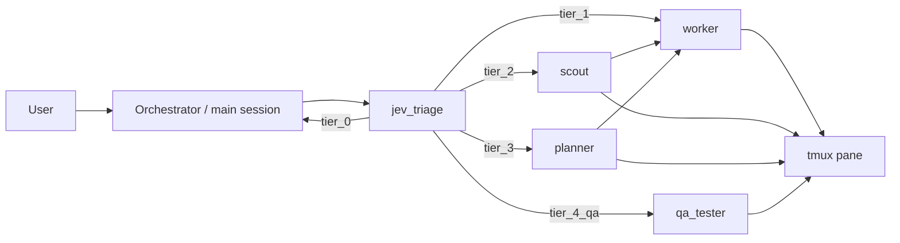

# Ultimate Pi

**Multi-agent routing for the [Pi coding agent](https://pi.dev).**

[](./LICENSE)
[](https://nodejs.org)
[](https://pi.dev)
[](https://github.com/VisionCraft3r/ultimate-pi/actions/workflows/ci.yml)

```
   >_  THE ULTIMATE  PI
   ███████████████████████████╗
   ╚══██████╔════════██████╔══╝
      ██████║        ██████║
      ██████║        ██████║
      ██████║        ██████║
   ████████████╗  ████████████╗
   ╚═══════════╝  ╚═══════════╝
              Multi-agent routing for the Pi CLI.
```

## What it is

Ultimate Pi is a batteries-included configuration and extension pack for the
[Pi coding agent](https://pi.dev) by Mario Zechner ([earendil-works/pi](https://github.com/earendil-works/pi)).
It wires up tiered task routing, a five-role subagent team, tool allowlisting,
cross-provider rate-limit fallback, and a handful of quality-of-life
extensions (bash safety guard, browser QA tools, web fetch/search, prompt
snippets, required pi-lens/graft code intelligence, and optional memory/cache)
into one installable package.

**Ultimate Pi is not affiliated with Anthropic, OpenAI, Cursor, OpenRouter,
DeepSeek, or TypeSafe AI.** It integrates with their public APIs/SDKs as a
third party. See [NOTICE.md](./NOTICE.md) for full attribution.

## Features

- **JEV tiered routing** — every request is classified into `tier_0`…`tier_4_qa`
  so cheap/local work stays in the main session and complex work fans out.
- **Five-role subagent team** — `scout`, `worker`, `planner`, `researcher`,
  `qa_tester`, each with its own tool allowlist and model.
- **Tool allowlisting** — subagents launch with `--no-extensions` and an
  explicit `--tools` allowlist; nothing is inherited by accident.
- **Cross-provider 429 fallback** — configurable per-provider and per-agent
  fallback chains so a quota hit on one provider fails over automatically.
- **Planner spec handoff** — a `handoff_spec` tool and `.ask` silent-park
  watchdog for spec-ready plan review.
- **bash-guard** — a safety net around destructive shell commands, including
  a catastrophic-operation floor that applies even when the interactive guard
  is disabled.
- **Browser QA tools**, **web fetch/search**, **prompt snippets**, required
  pi-lens/graft code intelligence, and optional observational memory and cache
  graphing.

Graft is used first for contextual lookup across the repo; pi-lens handles
semantic navigation and diagnostics. If either is unavailable, Ultimate Pi
falls back to the remaining tools rather than blocking the session.

## Requirements

- macOS or Linux. Windows is supported via WSL only (the subagent orchestration
  depends on `tmux`).
- Node.js `>=22.19.0`, `git`, `tmux`.
- At least one configured model provider (Anthropic, OpenAI Codex, Cursor,
  OpenRouter, DeepSeek, OpenAI, or another OpenAI-compatible provider).
- Optional: an OpenRouter API key (for JEV routing), a DeepSeek API key (for
  observational memory), a Google Custom Search key/CSE id (for `web_search`),
  and `python3` / `yt-dlp` (for the bundled skills).

## Quick start

```bash
npx github:VisionCraft3r/ultimate-pi
```

or clone and run locally:

```bash
git clone https://github.com/VisionCraft3r/ultimate-pi.git
cd ultimate-pi
npm install
node bin/ultimate-pi.mjs
```

Re-run any step later, non-interactively with `--yes`, or fully scripted with
`--answers <file.json>` (see `test/fixtures/answers.json` for the shape).

## Installer walkthrough

`ultimate-pi install` (the default command) walks through:

1. **Preflight** — checks Node, `pi` on `PATH`, `tmux`, platform, and the
   target agent directory.
2. **Providers** — select and authenticate one or more model providers
   (OAuth via Pi's `/login`, or a masked API-key prompt).
3. **Agent models** — assign a primary model to each of the five agent roles.
4. **Fallbacks** — configure global per-provider 429 chains and optional
   per-agent overrides.
5. **JEV** (optional) — an OpenRouter key for tiered routing; skippable, with
   a local heuristic fallback if you skip it.
6. **Observational memory** (optional) — a DeepSeek key to enable a lightweight
   session observer/consolidator.
7. **Packages** — required pi-lens and pi-graft; optional plannotator and pi-cache-graph.
8. **Apply** — installs packages, merges `settings.json` and `auth.json`
   (with timestamped backups), and splices the routing doc into `AGENTS.md`
   between marker comments.
9. **macOS extras** (optional, darwin only) — completion beep, iTerm2 status line.
10. **Doctor** — a self-check summarizing what's configured and what still
    needs attention.

Every write to an existing file is backed up first, and API keys are never
echoed, logged, or passed on the command line.

## Providers

| Provider | Auth | Notes |
|---|---|---|
| `anthropic` | OAuth (`/login`) or `ANTHROPIC_API_KEY` | |
| `openai-codex` | OAuth (`/login`, ChatGPT) | |
| `cursor` | OAuth via `@schultzp2020/pi-cursor` | |
| `openrouter` | API key | also used for JEV |
| `deepseek` | API key | also used for observational memory |
| `openai` | API key | |
| `other` | API key | any OpenAI-compatible provider id |

See [docs/providers.md](./docs/providers.md) for a per-provider walkthrough.

## Agents & models

| Agent | Role |
|---|---|
| `scout` | fast multi-file search and structure mapping |
| `worker` | writes code, runs builds/tests |
| `planner` | architecture breakdowns, spec-ready handoff |
| `researcher` | web research, external docs |
| `qa_tester` | drives a live browser/UI |

Change assignments any time with `ultimate-pi setup agents` or the in-Pi
`/ModelAgents` command.

### Fallback models

Ultimate Pi configures two layers of rate-limit fallback, stored in
`<agentDir>/model-agents.json`:

```json
{
  "fallbacks": {
    "anthropic": [{ "provider": "openrouter", "id": "openai/gpt-5.4" }],
    "openrouter": [{ "provider": "anthropic", "id": "claude-sonnet-4.6" }]
  },
  "agentFallbacks": {
    "worker": [{ "provider": "anthropic", "id": "claude-sonnet-4.6" }]
  }
}
```

Resolution order on a 429: `agentFallbacks[<agent>]` (or `main` for the
orchestrator) → `fallbacks[<provider>]` → a derived default chain across
configured providers → no fallback (logged once). Re-run this step any time
with `ultimate-pi setup fallbacks`.

## JEV routing

JEV (`jev_triage` / `jev_sentinel`) is a routing classifier that sorts each
request into a tier before deciding how to handle it:

| Tier | Meaning |
|---|---|
| `tier_0` | answer directly, no subagent |
| `tier_1` | a single, obviously local fix — one `worker` |
| `tier_2` | needs a location scout first — `scout` then `worker` |
| `tier_3` | new subsystem or architecture — `planner` |
| `tier_4_qa` | needs a live browser/UI — `qa_tester` |

`tier_4_qa` is composed from a UI-likelihood threshold (`noul ≥ 0.75`) and a
confidence threshold (`≥ 0.7`). Results below 70% confidence for
`tier_3`/`tier_4_qa`, or below 50% for other tiers, are treated as low
confidence and flagged.

JEV itself is **[Jev](https://openrouter.ai/typesafe/jev-1.13)**, a proprietary
System One decision model by [TypeSafe AI](https://typesafe.ai/), accessed via
[OpenRouter](https://openrouter.ai/) as `typesafe/jev-1.13`. It is not included
in this repository and is not covered by Ultimate Pi's MIT license — you bring
your own OpenRouter API key with access to the model. Without a key, JEV falls
back to a local keyword heuristic and prints a visible
`⚠ JEV not configured` warning. Override the model/endpoint with
`ULTIMATE_PI_JEV_MODEL` / `ULTIMATE_PI_JEV_ENDPOINT`. See
[docs/jev.md](./docs/jev.md) for details.

## Architecture overview



Subagents launch with `--no-extensions` and an explicit `--tools` allowlist
from their agent profile, so no tool is inherited by accident; a handful of
extensions (like `jev_sentinel`) re-inject themselves into child sessions via
`registerToolExtension`. Quota-fallback listens for 429s and switches models
mid-session using the fallback chains above. See
[docs/architecture.md](./docs/architecture.md) for the full picture.

## Commands

```
ultimate-pi [install] [flags]
ultimate-pi setup <providers|agents|fallbacks|jev|memory|extras> [flags]
ultimate-pi doctor [flags]
ultimate-pi uninstall [flags]

Flags:
  --agent-dir <path>   Agent directory (else PI_CODING_AGENT_DIR, else ~/.pi/agent)
  --answers <file>     Pre-filled answers JSON (non-interactive)
  --yes                Accept all defaults
  --dry-run            Print actions without writing
  --offline            Skip network checks and live probes
  --local              Pi settings scope (local project), not package source
  --no-color           Disable ANSI color
  -h, --help           Show this help
```

In-Pi commands: `/ModelAgents` (edit agent models and fallback chains),
`/bash-guard`, `/browser`, `/snippets`, `/builtin-header`, and `/cache` /
`/om` if those optional packages are installed.

## Security & privacy

Credentials live in `<agentDir>/auth.json` (mode `0600`) or environment
variables — never in this repository, never logged, never printed. Nothing
Ultimate Pi writes is committed anywhere; every file it touches lives under
your local agent directory. See [SECURITY.md](./SECURITY.md) for how to
report a vulnerability.

## Troubleshooting

See [docs/troubleshooting.md](./docs/troubleshooting.md), or run
`ultimate-pi doctor` for an automated self-check.

## Credits & attribution

Ultimate Pi builds on [Pi](https://pi.dev) (Mario Zechner / earendil-works,
MIT) and a number of community packages: `pi-interactive-subagents`,
`pi-observational-memory`, `@gotgenes/pi-anthropic-auth`,
`@schultzp2020/pi-cursor`, `@plannotator/pi-extension`, `pi-lens`,
`pi-cache-graph`, and `pi-graft`, plus JEV (TypeSafe AI, via OpenRouter). Full
detail, licenses, and copyright notices are in [NOTICE.md](./NOTICE.md).

## Contributing

See [CONTRIBUTING.md](./CONTRIBUTING.md) for dev setup, running
`npm test` / `npm run scan`, and commit conventions. Never commit API keys or
`auth.json`.

## License

[MIT](./LICENSE)
