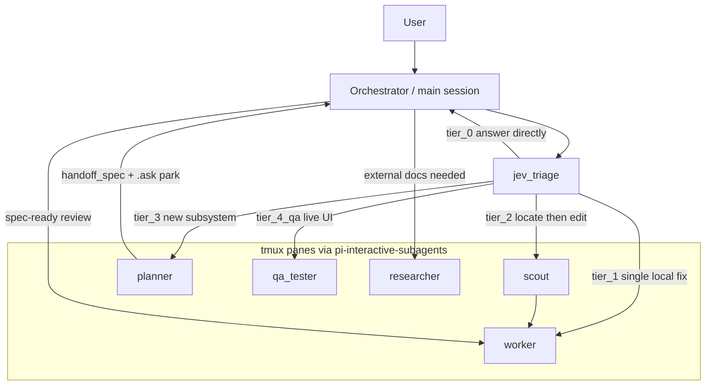

# Architecture

Ultimate Pi sits on top of the [Pi coding agent](https://pi.dev). The main Pi session is the **orchestrator**. Incoming work is classified, then either answered in place or fanned out to a five-role subagent team. Each subagent runs in its own [tmux](https://github.com/tmux/tmux) pane via [`pi-interactive-subagents`](https://github.com/AmosIBoukir/pi-interactive-subagents) (HazAT's original plus Amos Blomqvist's tmux-only fork). See [NOTICE.md](../NOTICE.md) for attribution.

This page covers four pieces that work together:

1. JEV routing and the five agent roles
2. Tool allowlisting (and the few extensions that re-inject into child sessions)
3. Cross-provider 429 / quota fallback
4. Planner spec handoff before workers fan out

For provider setup see [docs/providers.md](./providers.md). For JEV itself see [docs/jev.md](./jev.md).

## Routing flow

```
user → orchestrator (main session)
        → jev_triage
            → tier_0      answer in the main session (no subagent)
            → tier_1      one worker
            → tier_2      scout, then worker
            → tier_3      planner → spec-ready review → workers
            → tier_4_qa   qa_tester (live browser/UI)
            → researcher  spawned when the orchestrator needs external docs
```

Every request hits `jev_triage` first. The classifier returns a tier; the orchestrator then either stays put (`tier_0`) or launches the matching role(s). Subagents do not inherit the main session's tools or extensions — they start from a profile (see [Tool allowlisting](#tool-allowlisting)).

| Agent | Typical trigger | Job |
|---|---|---|
| *(main / orchestrator)* | `tier_0`, or coordinating any other tier | Talks to the user, launches roles, reviews planner specs |
| `scout` | `tier_2` | Fast multi-file search and structure mapping |
| `worker` | `tier_1`, after scout (`tier_2`), after planner handoff (`tier_3`) | Writes code, runs builds/tests |
| `planner` | `tier_3` | Architecture breakdowns; emits a spec via `handoff_spec` |
| `researcher` | orchestrator decision (external docs / web) | Web research, third-party docs |
| `qa_tester` | `tier_4_qa` | Drives a live browser/UI |

`tier_4_qa` is composed from a UI-likelihood threshold (`noul ≥ 0.75`) and a confidence threshold (`≥ 0.7`). Low-confidence results (below 70% for `tier_3` / `tier_4_qa`, below 50% otherwise) are flagged rather than treated as a hard route. Without an OpenRouter key, triage falls back to a local keyword heuristic and prints `⚠ JEV not configured`.

## Diagram



Each of `scout`, `worker`, `planner`, `researcher`, and `qa_tester` gets its own tmux pane. The orchestrator stays in the original session and talks to those panes; it does not share a process with them.

## Tool allowlisting

Subagents launch with `--no-extensions` plus an explicit `--tools` allowlist taken from their agent-profile frontmatter. Nothing from the parent session is inherited by accident: a worker cannot pick up the researcher's web tools, and a scout cannot pick up the worker's write/build tools, unless that tool is on the profile list.

A small set of extensions **re-inject** themselves into child sessions after launch via `registerToolExtension`. Those are the ones that have to keep working no matter which role is running:

- **`jev_sentinel`** — keeps JEV available in the child so a spawned agent can re-triage or stay consistent with the parent's routing context.
- **`quota-fallback`** — keeps the 429 listener attached so a child that hits a provider quota can fail over without returning to the orchestrator first.

Everything else stays off unless the profile named it. That is the allowlisting model: default-deny on extensions and tools, then an explicit list, then a handful of self-registering sentinels.

## Quota fallback (429)

`quota-fallback` listens for rate-limit / quota responses and switches models mid-session. Chains live in `<agentDir>/model-agents.json` and are resolved in this order:

1. **`agentFallbacks[<agent>]`** — per-role override. The orchestrator is keyed as `main`.
2. **`fallbacks[<provider>]`** — global per-provider chain.
3. **Derived default** — a chain built from the providers that are actually configured.
4. **None** — no fallback; the miss is logged once and the error surfaces.

Example shape:

```json
{
  "fallbacks": {
    "anthropic": ["openai-codex/gpt-5.6-sol", "cursor/cursor-grok-4.6-xhigh"],
    "openai-codex": ["anthropic/claude-sonnet-5", "cursor/cursor-grok-4.6-xhigh"],
    "cursor": ["openai-codex/gpt-5.6-sol", "anthropic/claude-sonnet-5"]
  },
  "agentFallbacks": {
    "worker": ["anthropic/claude-sonnet-5"]
  }
}
```

On a 429 for a `worker` using Anthropic, that file would try `agentFallbacks.worker` first (`anthropic/claude-sonnet-5` — already on Anthropic, so the next step still matters if *that* call 429s), then `fallbacks.anthropic`, then the derived default. Reconfigure any time with `ultimate-pi setup fallbacks` or the in-Pi `/ModelAgents` command.

## Planner handoff

`tier_3` is the only path that is supposed to produce a written spec *before* code lands.

1. `jev_triage` routes the request to `planner`.
2. The planner works in its own tmux pane and, when the breakdown is ready, calls the **`handoff_spec`** tool instead of starting implementation itself.
3. `handoff_spec` parks the planner with a **`.ask` silent-park watchdog**: the pane stays alive but does not keep generating, so the spec cannot be overwritten while the orchestrator reads it.
4. The orchestrator reviews the spec ("spec-ready"). If it is incomplete, the planner is resumed. If it is ready, the orchestrator fans out one or more `worker` panes against that spec.

Workers never see a half-written plan. The watchdog is what keeps the planner from talking over the review.

## Related

- [README.md](../README.md) — product overview and installer flow
- [docs/jev.md](./jev.md) — JEV model, thresholds, heuristic fallback, env overrides
- [docs/providers.md](./providers.md) — per-provider auth and notes
- [docs/troubleshooting.md](./troubleshooting.md) — doctor, 429s, missing tmux, JEV not configured
